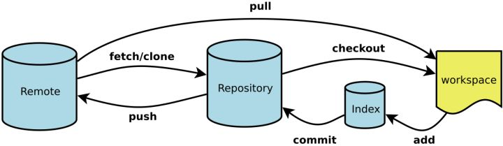

Git是一种开源分布式版本控制系统(VCS)，也是Github的核心。Git具有简单，快速，高效，可扩展性好等优点，所以Git也是目前最受欢迎的VCS。([Git 简史](https://git-scm.com/book/zh/v2/%E8%B5%B7%E6%AD%A5-Git-%E7%AE%80%E5%8F%B2))

Git提供了多种使用模式，桌面客户端或者是命令行模式，以方便用户进行项目版本管理，以及不同用户之间的协同项目处理。

命令行模式下，用户可以使用所有的命令操作实现Git全部功能，相较之下，GUI模式只是Git简化版。

Workspace：工作区
Index / Stage：暂存区
Repository：仓库区（或本地仓库）
Remote：远程仓库